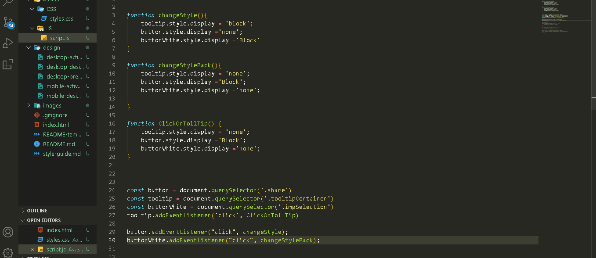

# Frontend Mentor - Article preview component solution

This is a solution to the [Article preview component challenge on Frontend Mentor](https://www.frontendmentor.io/challenges/article-preview-component-dYBN_pYFT). Frontend Mentor challenges help you improve your coding skills by building realistic projects. 

## Table of contents

- [Overview](#overview)
  - [The challenge](#the-challenge)
- [My process](#my-process)
  - [Built with](#built-with)
  - [What I learned](#what-i-learned)
- [Author](#author)


## Overview

### The challenge

Users should be able to:

- View the optimal layout for the component depending on their device's screen size
- See the social media share links when they click the share icon

### Screenshot/videos




### Links

- Solution URL: [Add solution URL here](https://your-solution-url.com)


## My process

### Built with

- Semantic HTML5 markup
- CSS custom properties
- Flexbox
- JavaScript
- DOM tree


### What I learned

- DOM tree

```js
target.style.property = 'value';
```


## Author

- LinkeDin - [Samuel Espíndola](https://www.linkedin.com/in/samuel-espindo-la/)
- Frontend Mentor - [@samuelESP](https://www.frontendmentor.io/profile/samuelESP)
- Twitter - [@SamuelBraSam](https://twitter.com/SamuelBraSam)


