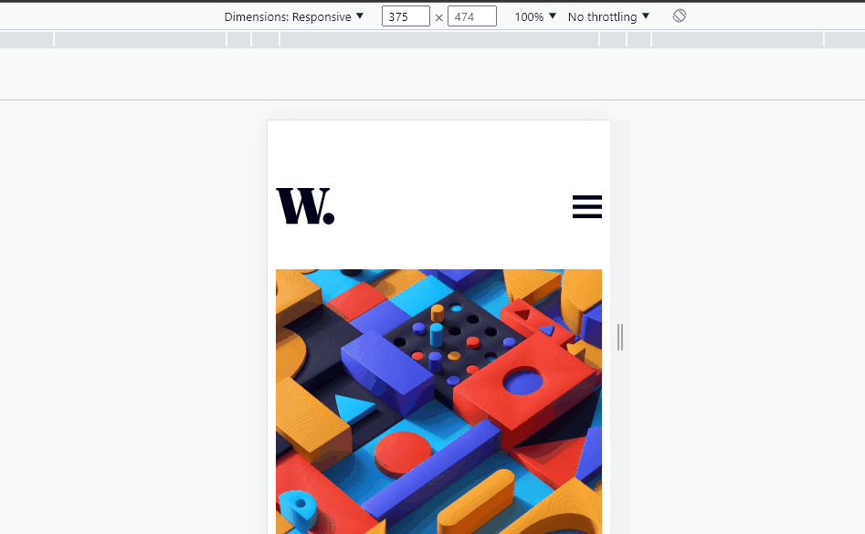

# Frontend Mentor - News homepage solution

This is a solution to the [News homepage challenge on Frontend Mentor](https://www.frontendmentor.io/challenges/news-homepage-H6SWTa1MFl). Frontend Mentor challenges help you improve your coding skills by building realistic projects. 

## Table of contents

- [Overview](#overview)
  - [The challenge](#the-challenge)
  - [GIF](#Video)
- [My process](#my-process)
  - [Built with](#built-with)
  - [What I learned](#what-i-learned)
- [Author](#author)


## Overview

### The challenge

Users should be able to:

- View the optimal layout for the interface depending on their device's screen size
- See hover and focus states for all interactive elements on the page

### Video




## My process

### Built with

- Semantic HTML5 markup
- CSS custom properties
- Flexbox
- JavaScript
- DOM tree

### What I learned

I learned how to make a sidebar using css

## HTML
```html
<!--Lista/menu-->
<div class="header">
  <ul class="nav_list">
    <li><a href="#">Home</a></li>
    <li><a href="#">New</a></li>
    <li><a href="#">Popular</a></li>
    <li><a href="#">Trendia></li>
    <li><a href="#">Categories</a></li>
  </ul>
</div>
<!--sombra do HTML-->
  <div class="shadow"></div>
```
## CSS

```css
@keyframes sidebar{
    from{
        opacity: 0;
        transform: translateX(100%);
    }to{
        opacity: 1;
        transform: translateX(0);
    }
}
.icon_menu .close{
    display: none;
    position: absolute;
    z-index: 100;
    top: 0;
}
.nav_list{
    position: fixed;
    z-index: 99;
    top: 0;
    right: 0;
    bottom: 0;
    left: 27%;
    padding-top: 7rem;
    padding-left: 1.1rem;
    background:hsl(0, 0%, 100%);
    animation: sidebar .4s;
}

.nav_list li{
    list-style-type: none;
    font-size: 1.2rem;    
    padding-bottom: 30px;
}

.nav_list a{
    text-decoration: none;
    color: #000;
}

.showNav_list{
    transform: translateX(0);
}


.shadow{
    display: none;
    position: fixed;
    background-color: rgba(0,0,0,.5);
    width: 100%;
    height: 100%;
    background-size: cover;
    top: 0;
    left: 0;
}
```
## JS

```js
function sideBarOn() {
    Header.style.display = 'Block';
    Shadow.style.display = "Block";
    Close.style.display = 'Block';
}

function sideBarOff() {
    Header.style.display = 'none';
    Shadow.style.display = "none";
    Close.style.display = 'none';
}

const Open = document.querySelector('.open');
const Header = document.querySelector('.header');
const Shadow = document.querySelector('.shadow');
const Close = document.querySelector('.close');


Open.addEventListener('click', sideBarOn);
Close.addEventListener('click', sideBarOff);
```


## Author

- LiknedIn - [Samuel Espíndola](https://www.linkedin.com/in/samuel-espindo-la/)
- Frontend Mentor - [@samuelESP](https://www.frontendmentor.io/profile/samuelESP)
- Twitter - [@SamuelBraSam](https://twitter.com/SamuelBraSam)


