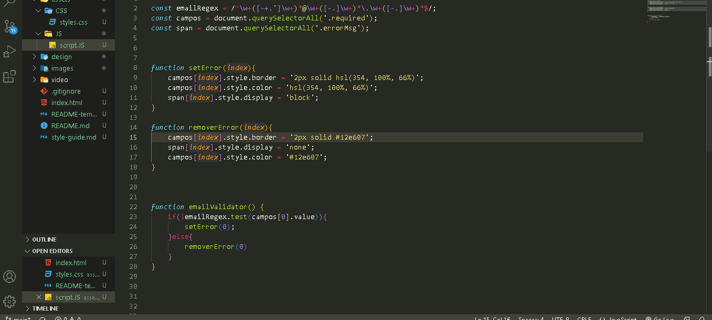

# Frontend Mentor - Ping coming soon page solution

This is a solution to the [Ping coming soon page challenge on Frontend Mentor](https://www.frontendmentor.io/challenges/ping-single-column-coming-soon-page-5cadd051fec04111f7b848da). Frontend Mentor challenges help you improve your coding skills by building realistic projects. 

## Table of contents

- [Overview](#overview)
  - [The challenge](#the-challenge)
  - [Screenshot/videos](#video)
- [My process](#my-process)
  - [Built with](#built-with)
  - [What I learned](#what-i-learned)
- [Author](#author)


## Overview

### The challenge

Users should be able to:

- View the optimal layout for the site depending on their device's screen size
- See hover states for all interactive elements on the page
- Submit their email address using an `input` field
- Receive an error message when the `form` is submitted if:
	- The `input` field is empty. The message for this error should say *"Whoops! It looks like you forgot to add your email"*
	- The email address is not formatted correctly (i.e. a correct email address should have this structure: `name@host.tld`). The message for this error should say *"Please provide a valid email address"*

### video



## My process

### Built with

- Semantic HTML5 markup
- CSS custom properties
- Flexbox
- JavaScript


### What I learned

how to make validators;
I can use the `setError` and `removeError` functions for all the types of validators I want.

```js
const emailRegex = /^\w+([-+.']\w+)*@\w+([-.]\w+)*\.\w+([-.]\w+)*$/;
const campos = document.querySelectorAll('.required');
const span = document.querySelectorAll('.errorMsg');


function setError(index){
    campos[index].style.border = '2px solid hsl(354, 100%, 66%)';
    campos[index].style.color = 'hsl(354, 100%, 66%)';
    span[index].style.display = 'block';
}

function removerError(index){
    campos[index].style.border = '2px solid #12e607';
    span[index].style.display = 'none';
    campos[index].style.color = '#12e607';
}


function emailValidator() {
    if(!emailRegex.test(campos[0].value)){
        setError(0);
    }else{
        removerError(0)
    }
}
}
```

## Author

- LinkedIn - [Samuel Espíndola Alves de Souza](https://www.linkedin.com/in/samuel-espindo-la/)
- Frontend Mentor - [@samuelESP](https://www.frontendmentor.io/profile/samuelESP)
- Twitter - [@SamuelBraSam](https://twitter.com/SamuelBraSam)

