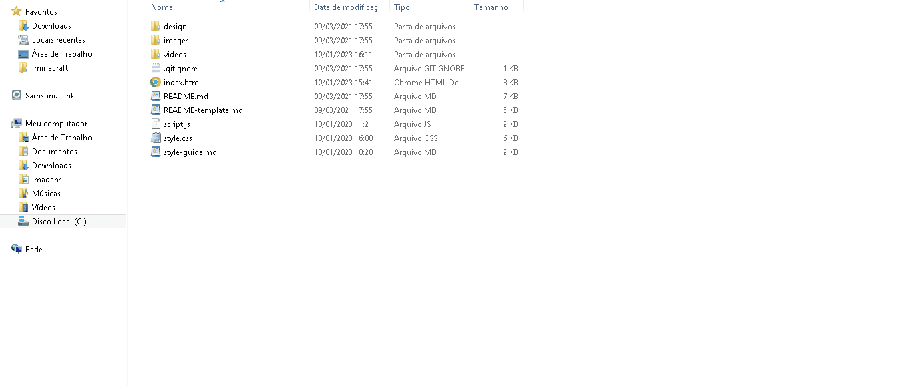
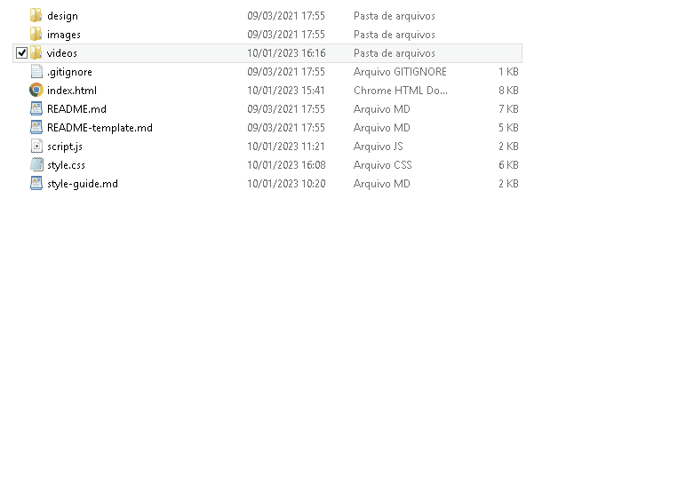

# Frontend Mentor - Social media dashboard with theme switcher solution

This is a solution to the [Social media dashboard with theme switcher challenge on Frontend Mentor](https://www.frontendmentor.io/challenges/social-media-dashboard-with-theme-switcher-6oY8ozp_H). Frontend Mentor challenges help you improve your coding skills by building realistic projects. 

## Table of contents

- [Overview](#overview)
  - [The challenge](#the-challenge)
  - [videos](#videos)
- [My process](#my-process)
  - [Built with](#built-with)
  - [What I learned](#what-i-learned)
  - [Useful resources](#useful-resources)
- [Author](#author)


## Overview

### The challenge

Users should be able to:

- View the optimal layout for the site depending on their device's screen size
- See hover states for all interactive elements on the page
- Toggle color theme to their preference

### videos

#### desktop


##### mobile



## My process

### Built with

- Semantic HTML5 markup
- CSS custom properties
- Flexbox
- CSS Grid
- JavaScript
- JavaScript(DOM)


### What I learned

How to use linear-gradient:
```css
.in{
    border-top: 5px solid;
    border-image-slice: 1;
    border-image-source: linear-gradient(to left, hsl(37, 97%, 70%), hsl(329, 70%, 58%));
}
```
How to use classList properties in a Node/HtmlCollection
```js
elementos.forEach(function(elemento){
        elemento.classList.toggle(WhiteMode);
    });
    elementosBottom.forEach(function(elemento){
        elemento.classList.toggle(WhiteMode);
    });
    todosH2.forEach(function(elemento){
        elemento.classList.toggle(WhiteMode);
    });
    todosOt.forEach(function(elemento){
        elemento.classList.toggle(WhiteMode);
    });
```


### Useful resources

- [gradient-borders-in-css](https://css-tricks.com/gradient-borders-in-css/) - this helped me a lot, because I had no idea what gradient Borders was and I didn't even know that was the name.


## Author

- LinkedIn - [Samuel Espíndola](https://www.linkedin.com/in/samuel-espindo-la/)
- Frontend Mentor - [@samuelESP](https://www.frontendmentor.io/profile/samuelESP)
- Twitter - [@SamuelBraSam](https://www.twitter.com/SamuelBraSam)


